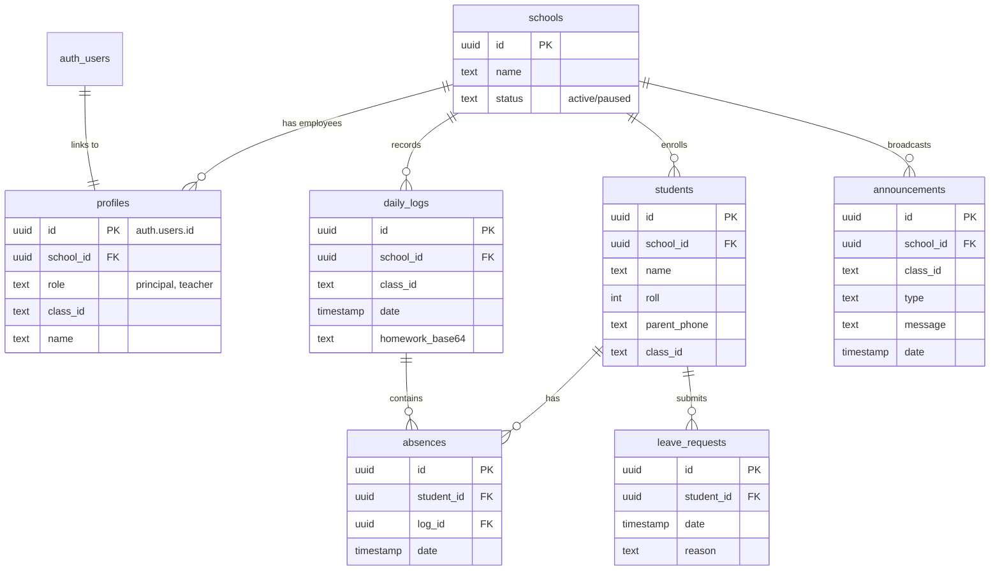

# School Saathi (Digitizer)

School Saathi is a multi-tenant, modern school digitization dashboard designed for Principals, Teachers, and Parents. It streamlines daily attendance, homework distribution, announcements, and school management into one minimalistic and highly responsive web app.

## 🚀 Current Features

### Teacher Dashboard
- **Attendance Tracking**: Rapid toggle-based attendance system with WhatsApp integration to instantly notify parents of absentees.
- **Student Management**: Add and manage enrolled students with their roll numbers and parent WhatsApp details.
- **Homework Upload**: Integrated Camera Capture to take pictures of the whiteboard/homework and upload them directly to the database.
- **AI-Powered Announcements**: An integrated Gemini 3.6 Flash AI assistant that helps teachers draft professional, polite notices (e.g., "PTM Tomorrow", "Diwali Holiday") from short phrases and broadcast them via WhatsApp with automatic school and teacher signatures.

### Principal Dashboard
- **School-Wide Analytics**: High-level overview of total classes, active teachers, and total students.
- **Class Directory**: A structured view of all classes in the school.
- **Teacher View Access**: Principals can click into any specific class to see the exact dashboard the teacher sees (read-only monitoring).

### Parent Portal (Passwordless)
- **Direct Access**: Parents access a unique, secure link (e.g., `/s/[studentId]`) without needing a password.
- **Daily Logs**: View daily attendance status, uploaded homework images, and active teacher announcements.
- **Leave Requests**: Request sick leave directly from the portal, which updates the database instantly.

### System & Security
- **Multi-Tenancy**: Built for SaaS scalability. Multiple schools can use the platform. Data is separated by `school_id`.
- **Subscription Kill-Switch**: Middleware checks if a school's status is `paused`. If so, it redirects all teachers and principals to a `/suspended` page, blocking access until billing is resolved.
- **Role-Based Access Control (RBAC)**: Secure routing via Supabase Auth and Middleware (`/teacher`, `/principal`).

---

## 🏗️ Project Structure & Architecture

The application is built on **Next.js 14 (App Router)** and **Supabase**.

```text
/app
 ├── /api               # Backend endpoints (Gemini AI, Announcements, Students, Logs)
 ├── /auth              # Supabase authentication and signout routes
 ├── /login             # Minimalist login page with role detection
 ├── /principal         # Principal dashboard & nested /class/[classId] views
 ├── /teacher           # Teacher client component and main UI
 ├── /s                 # Public-facing Parent/Student portal (/s/[studentId])
 ├── /suspended         # Kill-switch fallback page for paused schools
 ├── layout.tsx         # Root layout with PWA Manifest (School Sarthi Logo)
 └── middleware.ts      # Core Edge middleware for auth protection, role routing, and SaaS kill-switch
```

---

## 🗄️ Database Graph (Schema)

The following Mermaid diagram illustrates the Supabase PostgreSQL database structure and how the tables are connected.



### Table Relationships (How they connect)
1. **`schools`**: The core tenant table. Every user and data point belongs to a school.
2. **`profiles`**: Extends Supabase's built-in `auth.users` to store the user's role (Principal/Teacher), their assigned `class_id`, and their `school_id`.
3. **`students`**, **`daily_logs`**, and **`announcements`** all carry a `school_id` foreign key. This ensures data isolation in the UI.
4. **`absences`**: A junction table that links a `student_id` to a specific `log_id` (a specific day's homework/attendance record).
5. **`leave_requests`**: Directly attached to a `student_id` so parents can submit leaves that teachers can query by class.

---

## 🔮 Future Scope

1. **Teacher Onboarding Flow**: Create a SuperAdmin dashboard to quickly onboard new schools, set up their `school_id`, and generate invite links for Principals.
2. **Row Level Security (RLS)**: Enforce RLS natively in Supabase so that database queries automatically filter by the authenticated user's `school_id` at the database layer (currently handled in application logic).
3. **Automated Analytics**: Generate weekly PDF or UI reports for Principals detailing average attendance rates, most active teachers, and chronic absenteeism.
4. **Push Notifications**: Upgrade the Parent Portal to a fully installable PWA with Service Worker push notifications, moving away from WhatsApp dependencies.
5. **Multi-Language Support (i18n)**: Allow the AI Assistant and UI to automatically translate announcements and interfaces into regional languages (e.g., Hindi, Marathi) based on parent preferences.
